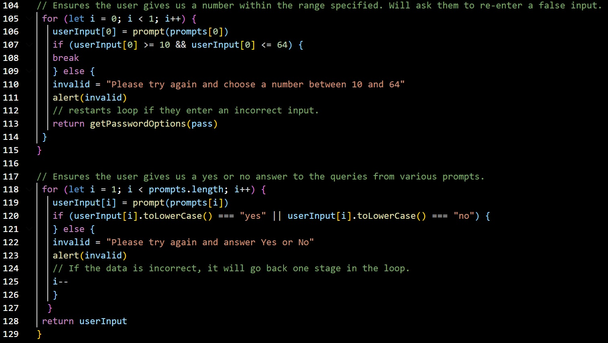

### Password-Generator

I was hired to create an application that employees can use to create a randomly generated password, while giving the user options of which characters to include. 

## The Goal

The objective was to develop, in JavaScript, a randomly generated password which would work from a simple click of a button.

The required parameters were:

    * Length of password to be at least 10 characters but no more than 64.
    * To give the user the choice of
      * Lowercase characters
      * Uppercase characters
      * Numeric characters
      * Special characters ($@%&*, etc)

The inputs were to be validated to ensure that it was user friendly for all employees. 

The secondary objective was to ensure that the code would still function should more data be added, and that it was commented in a way which enables other developers to take over if required. 

## Usage

To view the project, please follow the links below:

https://bcott93.github.io/password-generator/

### Credits:

* [w3schools](https://www.w3schools.com/jsref/jsref_for.asp)
* [Javascript tutorial](https://www.javascripttutorial.net/javascript-multidimensional-array/#:~:text=To%20access%20an%20element%20of,element%20of%20the%20inner%20array)

### License

Please see the License in the Repo. 
